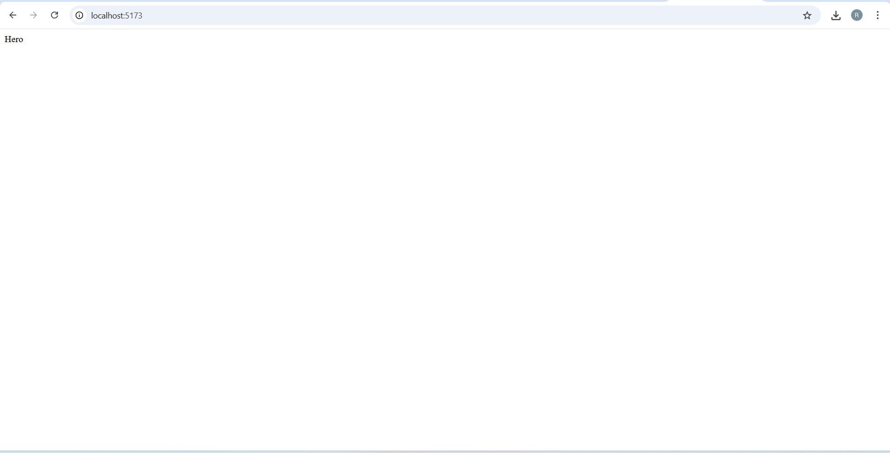
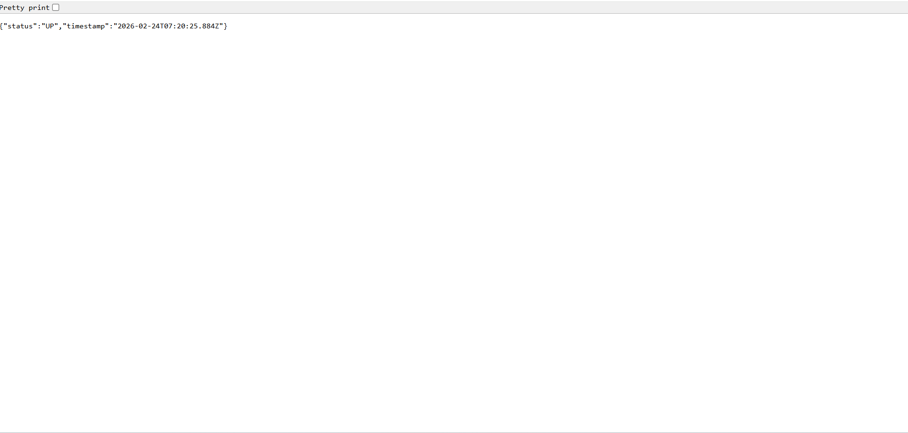
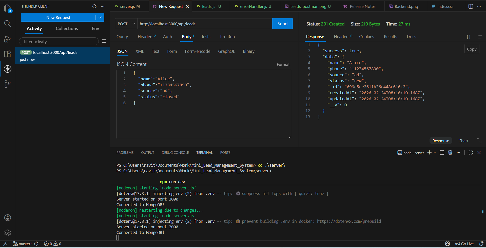
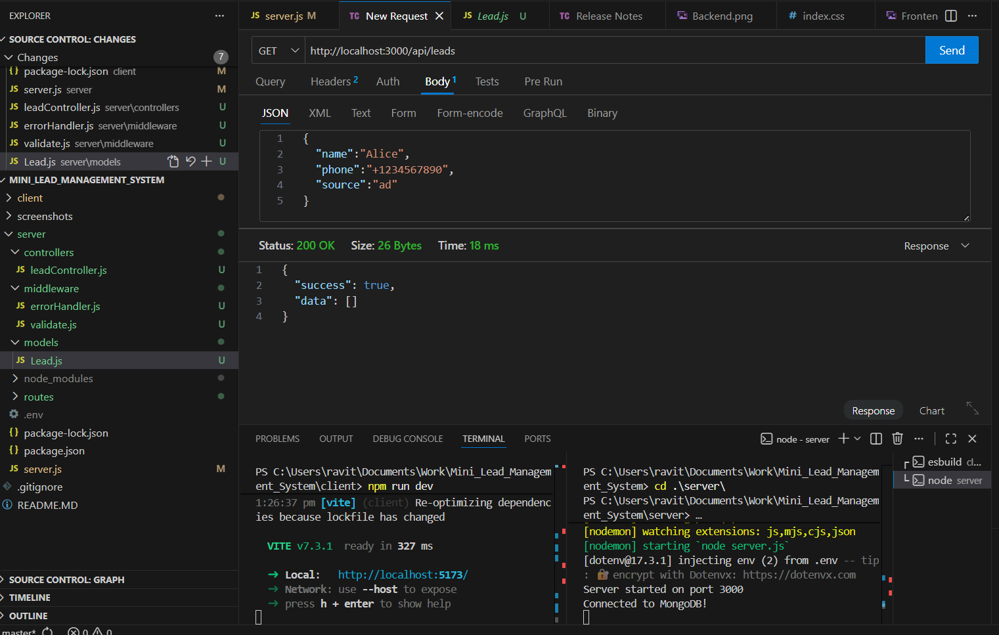

# Mini Lead Management System 🚀

A full-stack application with a **Node.js and Express** server and a **React** client.

## 📁 Project Structure
- **/client**: Frontend application.
- **/server**: Node.js Backend API.
- **/.github**: GitHub Actions CI/CD workflows.

## 🛠️ Prerequisites
- [Node.js](https://nodejs.org) (v18+)
- [Git](https://git-scm.com)
- [Express](https://expressjs.com)

## The Day one tasks Screenshot
### Frontend

### Backend 

# Day 2

### postman_screenshots
### 1. Post Method's SS

### 2. Get Method's SS

# Day 3

### Screen Recording

<video src="./screenshots/Day3_record.mp4" loop autoplay >
  Your browser does not support the video tag.
</video>
